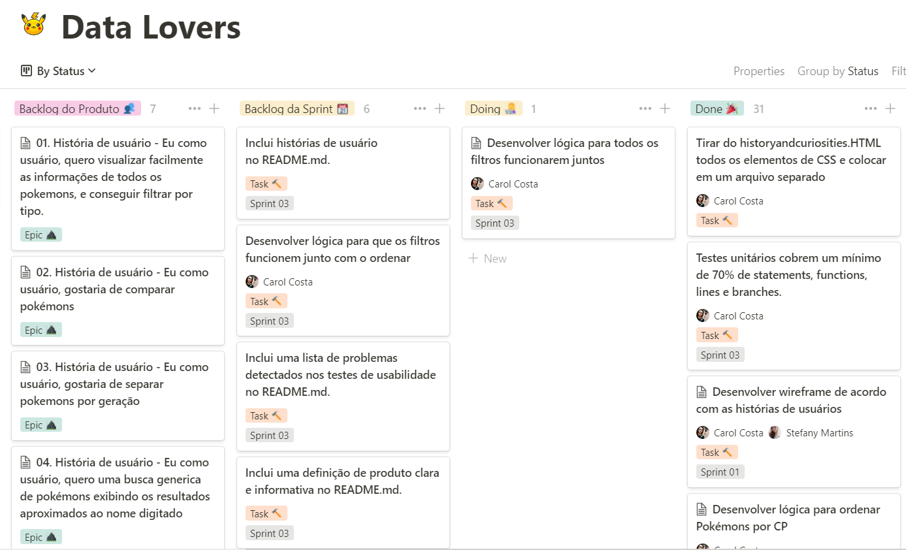
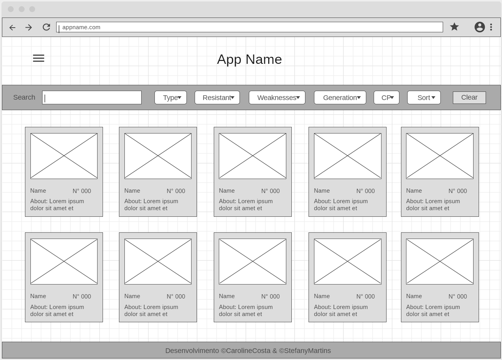
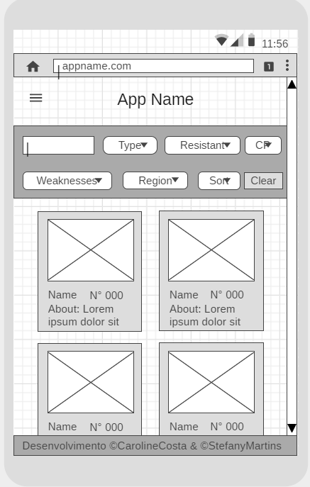
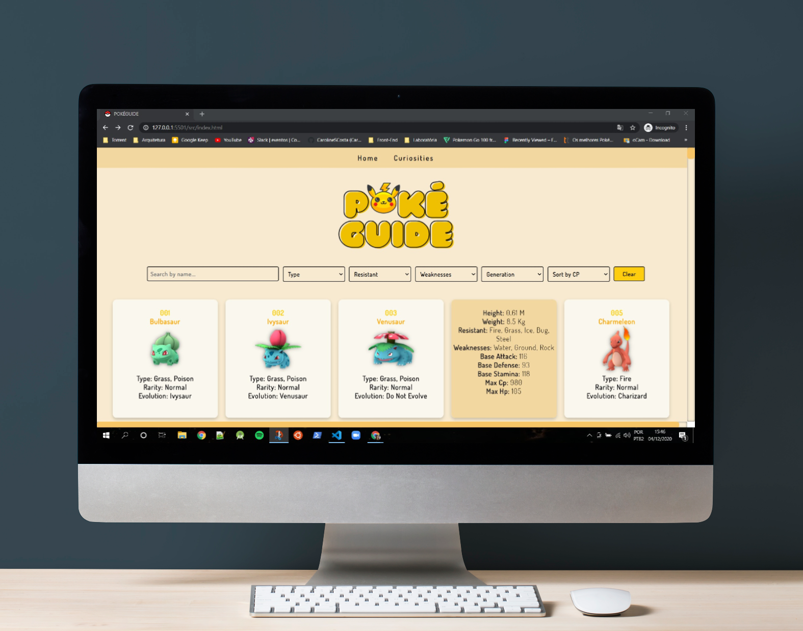
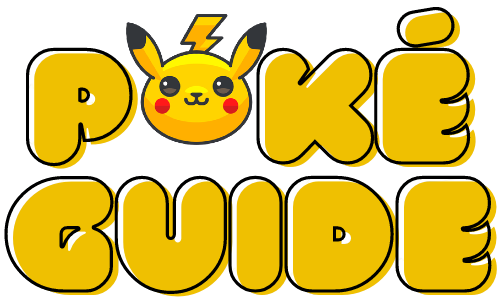
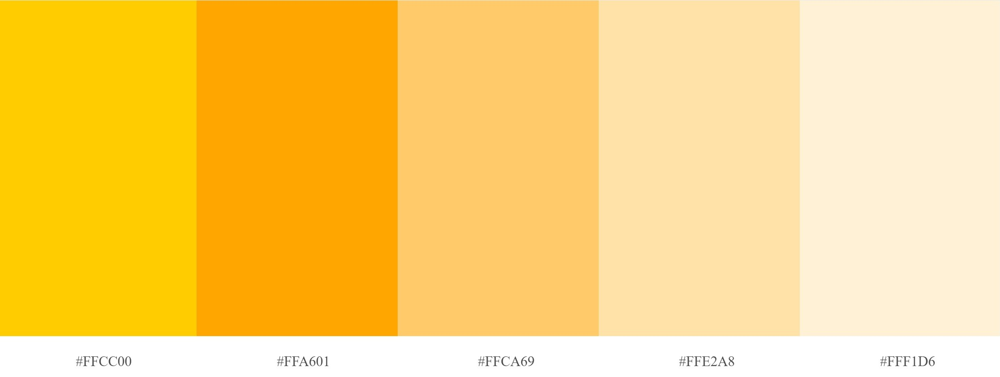

# POKÉGUIDE

✨ Para acessar a aplicação [Clique aqui!]() ✨

## Índice

* [1. Introdução](#1-introdução)
* [2. Sobre a aplicação](#2-sobre-a-aplicação)
* [3. Identificação dos usuários](#3-identificação-dos-usuários)
* [4. Histórias de usuários](#4-histórias-de-usuários)
* [5. Processo de criação](#5-processo-de-criação)
* [6. Testes](#6-testes)
* [7. Desenvolvimento](#7-desenvolvimento)
* [8. Desenvolvedoras](#8-desenvolvedoras)

***

## 1. Introdução

 O objetivo desse projeto era desenvolver uma aplicação que permita visualizar e manipular dados, e a partir de histórias de usuário fornecer funcionalidades que estivessem de acordo com a necessidade.
 O projeto proposto pela Laboratória foi realizado em duplas, e tralhamos com o banco de dados do Pokémon.
 
 

 </img>
 

 

## 2. Sobre a aplicação

A intenção da aplicação é fornecer um guia estruturado para os fãs da franquia, com uma experiência de usuário clara e objetiva de realizar buscas pelo nome e efetuar a filtragem por forças, fraquezas, resistências, gerações ainda podendo o usuário ordenar por CP, além disso foi disponibilizado uma pesquisa sobre a história e curiosidades sobre a geografia deste mundo e convivência entre pokemons e humanos, para melhor compreensão e imersão sobre o assunto.

## 3. Identificação dos usuários

Para identificar quem seriam os usuários da plataforma, realizamos pesquisas utilizando o [Google Forms](https://www.google.com/forms/about/), no qual foi possível identificar as reais necessidades de cada usuário e com base nesses dados definimos as histórias de usuários.

 

## 4. Histórias de usuários

 🔎 Com base nas necessidades dos usuários chegamos a cinco histórias de usuários:

 1. Eu como usuário, quero visualizar facilmente as informações de todos os pokemons, e conseguir filtrar por tipo.

 2. Eu como usuário, gostaria de filtrar pokémons por força e fraquezas.

 3. Eu como usuário, gostaria de separar pokemons por gerações.

 4. Eu como usuário, quero uma busca genérica de pokémons exibindo os resultados aproximados ao nome digitado.

 5. Eu como usuário, quero ordenar pokémons por força.

## 5. Processo de criação

 💡 Organização 

 Ao receber o projeto toda a organização das tarefas e processos foram realizadas utilizando o modelo de Kanban. Depois de toda a organização feita, definimos o tempo de cada tarefa e o que seria entregue em cada sprint.Além disso tiramos um tempo para definir os critérios de aceitação e a definição de pronto.

 

 💡 Interface

 O principal objetivo foi desenvolver uma interface em que fossem exibidas apenas as funcionalidades necessárias de forma simples e amigável ao usuário. Optamos por apresentar as informações em formato de cards e deixar as informações o mais visual possível. 

 💻 Wireframe inicial desktop

 📱 Wireframe inicial mobile

 💻 Interface final desktop

 📱 Interface final mobile

 💡 Logo

 Criamos uma logo que estivesse de acordo com o tema e que representasse a marca. Respeitamos a cor amarela que é utilizada pela marca e inserimos o Pikachu que é um dos Pokémons mais amados da franquia.

 
 
 💡 Paleta de cores
 
 A paleta de cores foi desenvolvida a partir do tom de amarelo utilizado na logo, porém para não sobrecarregar o olhar do usuário, foram utilizados tons pasteis criando harmonia visual.

 

 ## 6. Testes

 🔎 Usabilidade

 Realizamos testes com algumas das pessoas que se dispuseram testar a usabilidade durante o processo de desenvolvimento. Com isso, identificamos que: 

 ⚠️ Os usuários não estavam satisfeitos com o menu hambúrguer que foi proposto por ser mais uma etapa de click.
 ✔️ Como solução criamos um menu fixo acima da logo.

 ⚠️ Os usuários acharam a quantidade de filtros exagerada, apontaram que não viam necessidade de filtrar pokémons por ordem alfabética ou numérica.
 ✔️ Como solução removemos os filtros citados.

 🔎 Técnico

 Foram desenvolvidos testes unitários com jest para identificar possíveis falhas nas funções utilizadas, possibilitando a correção caso necessário antes de definir o produto como pronto.

 ## 7. Desenvolvimento

 🔧 Para esse projeto foram usados:

* HTML5
* CSS3
* Vanilla JavaScript
* Jest

 ## 8. Desenvolvedoras

 👩 [Caroline Costa](https://github.com/CarolineSCosta)

 👩 [Stefany Martins](https://github.com/martinstfn)
 

 
 

 

 </img>
 

